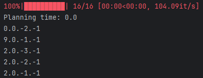
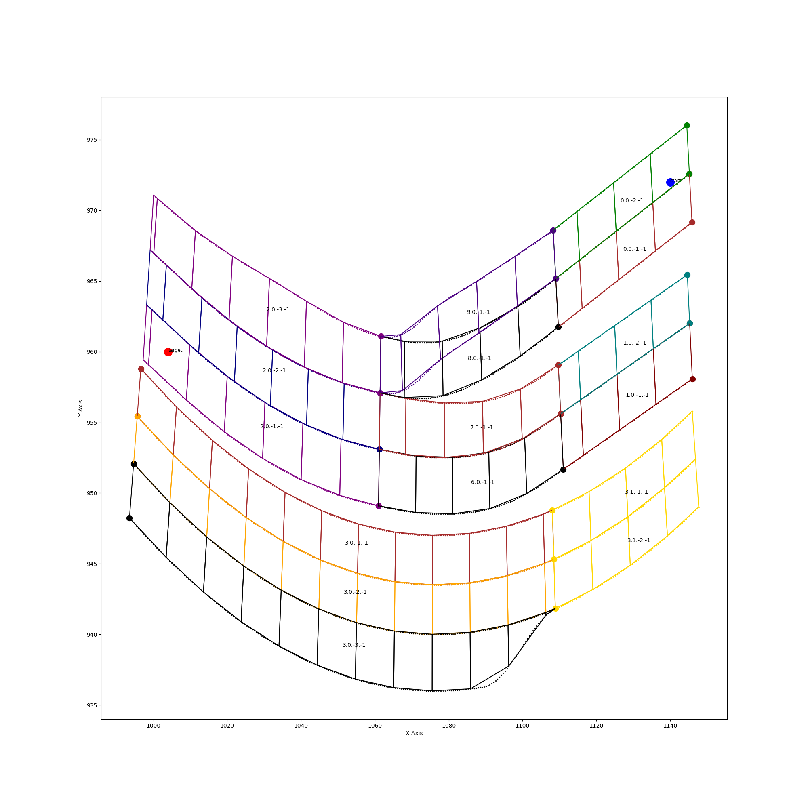

# sayo_planner  

---

## Contents Introduction
* **assets**    
资产
* **planner**    
规控器目录
  * **calculate_functions.py:**   
    数学计算方法
  * **const_var.py:**  
  常量定义文件  
  * **global_path_planner.py:**
  全局指引路径规划器
  * **map_info:**   
    结构化地图信息相关类
* **sample_reference_code**  
算法示例目录
  + **ray_casting.py:**  
  射线法判断车道原理示例
  + **A_star.py:**
  A*算法示例
* **test**  
测试代码目录
  * **global_path_planner_test.py:**  
    全局路径规划器可视化测试
  * **lane_match_test.py:**  
    道路匹配可视化测试  
  * **lane_visualizer.py:**  
    道路可视化器
  * **visualize_road_1.py:**  
    地图可视化文件1
  * **visualize_road_2.py:**  
    地图可视化文件2
* **visualization_of_traffic**  
道路可视化图片存储目录
---

## Install

* 方法一：  
    `cd`到`planner`目录下  
    `git clone https://github.com/Sayo0616/sayo_planner.git`

* 方法二：  
    下载压缩包，解压到`planner`目录下

---

## How to Test Lane-Match Algorithm  

1. **高精地图文件路径修改**：  
修改`test/lane_match_test.py`文件中的`xodr_file`，更改高精地图xodr文件路径  
2. **坐标点修改**：  
修改`test/lane_match_test.py`文件中的`points` 
3. **运行**：   
运行`test/lane_match_test.py`文件  

---  

## How to Test Global Path Planner

1. **高精地图文件路径修改**：  
修改`test/global_path_planner_test.py`文件中的`xodr_file`，更改高精地图xodr文件路径  
2. **坐标点修改**：  
修改`test/global_path_planner_test.py`文件中的`points` 
3. **运行**：   
运行`test/global_path_planner_test.py`文件  

  #### 示例  
  ```
  # 设置测试点坐标
  points = [
    [1140, 972, "start", "blue"],   # 起始点
    [1004, 960, "target", "red"]   # 目标点
]
  
  # 读取 xodr 文件
  xodr_file = "../../../scenario/fragment/0_76_merge_82/0_76_merge_82.xodr"
  ```
  控制台输出：  

   
  
  plot画图:  
  
  